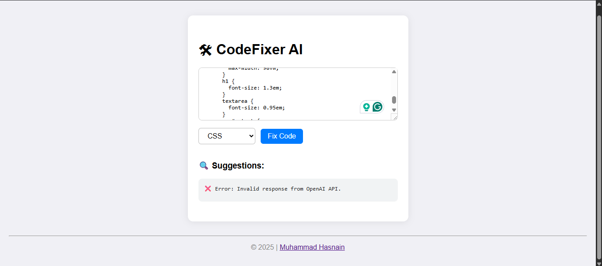

<p align="center">
  
</p>

# CodeFixer AI

CodeFixer AI is a web-based tool that helps you analyze and fix code errors using OpenAI's GPT models. It supports JavaScript, HTML, CSS, and Python code analysis.

## About This Project
This project includes:
- A responsive web frontend (`backend/index.html`) for code analysis and fixing
- A Node.js backend (`backend/server.js`) that securely connects to the OpenAI API
- A VS Code extension for in-editor code fixing (`extension/`)

All recent changes:
- Responsive design for all devices (HTML & CSS updated)
- Copyright and LinkedIn footer added
- Improved error handling for OpenAI API responses
- README and LICENSE files created and updated

## Features
- Paste your code and select the language
- Get instant AI-powered suggestions and fixes
- See explanations for detected errors

## How to Run

## Getting an OpenAI API Key
You need an OpenAI API key to use this tool. Get your key from: [https://platform.openai.com/api-keys](https://platform.openai.com/api-keys)
Paste your key in the backend environment variable as shown below.

### Backend
1. Install Node.js (v18+ recommended)
2. In the project root, run:
   ```
   npm install
   ```
3. Set your OpenAI API key as an environment variable:
   - On Windows (PowerShell):
     ```powershell
     $env:OPENAI_API_KEY="sk-..."  # Use your key from https://platform.openai.com/api-keys
     node backend/server.js
     ```
   - On Mac/Linux:
     ```bash
     export OPENAI_API_KEY="sk-..."  # Use your key from https://platform.openai.com/api-keys
     node backend/server.js
     ```

### Frontend
1. Open `backend/index.html` in your browser (works offline, but code fixing requires backend running)
2. Paste your code, select the language, and click "Fix Code"
3. The UI and output are fully responsive for mobile and desktop

## Project Structure
- `backend/` - Contains server, frontend files, and main logic
- `extension/` - VS Code extension for in-editor code fixing

## Notes
- Your OpenAI API key is required for the backend. For security, do not expose your key in frontend code.
- Always use the backend for code analysis (frontend direct API calls are not recommended and may not work with all key types)


## Requirements
- Node.js v18 or higher
- An OpenAI API key with access to GPT models (get from https://platform.openai.com/api-keys)

## Troubleshooting
- If you see errors about missing modules, run `npm install` in the project root.
- If the backend does not start, make sure your API key is set and Node.js version is correct.
- For CORS issues, always use the backend for code analysis requests.
- If you get an "Invalid response from OpenAI API" error, check your API key and model access at https://platform.openai.com/api-keys.

## Contributing
Pull requests are welcome! For major changes, please open an issue first to discuss what you would like to change.

## Contact
For questions or support, contact:
- Email: m.hasnainreactions@gmail.com
- Email: syedhasnainabdi@gmail.com
- LinkedIn: https://www.linkedin.com/in/m-hasnain-abdi/

## License
This project is licensed under the MIT License. See the [LICENSE](LICENSE) file for details.
